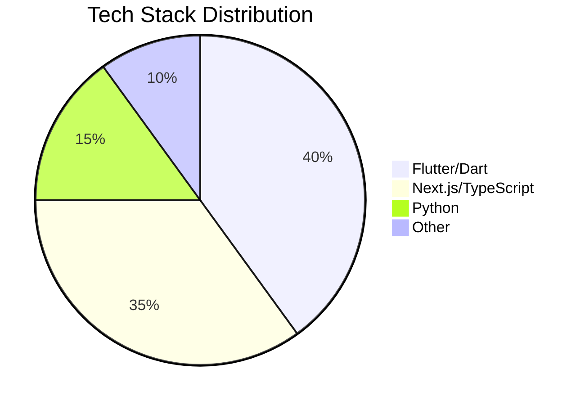
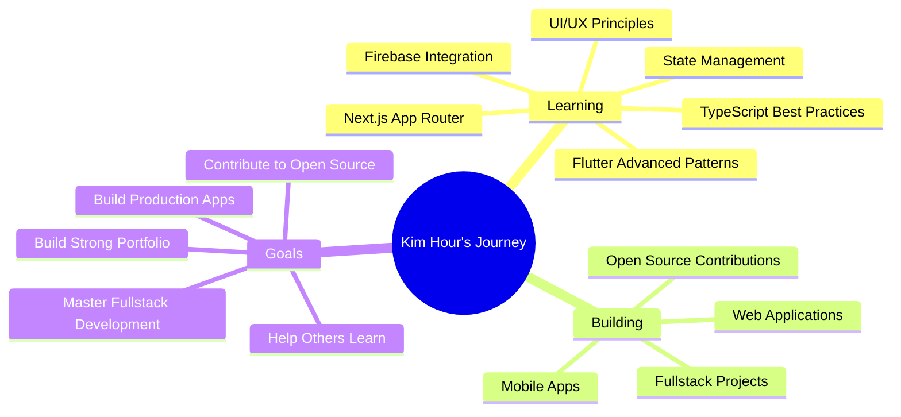

<div align="center">

# 👋 Hey there, I'm **Kim Hour!** 


### 🌈 Turning Coffee into Code Since... Recently! ☕→💻

[](https://github.com/LK-Hour)
[](https://github.com/LK-Hour)

</div>

---

## 🎯 About Me

```dart
class KimHour extends FullstackDeveloper {
  final String name = "Kim Hour";
  final String role = "Fullstack Developer";
  final String location = "🇰🇭 Cambodia";
  final String education = "Software Engineering Student @ CADT";
  
  List<String> passions = [
    "🦋 Flutter Development",
    "⚡ Next.js & React",
    "📱 Mobile-First Design",
    "🎨 Beautiful UIs & UX",
    "🚀 Full-Stack Solutions",
    "🌐 Web Development",
  ];
  
  Map<String, String> currentStatus = {
    "🎓": "Software Engineering @ CADT",
    "💻": "Building fullstack applications",
    "🌱": "Mastering modern web & mobile tech",
    "🎯": "Creating impactful digital experiences",
    "🔥": "Open to collaboration & learning",
  };
  
  void sayHi() {
    print("Thanks for dropping by! Let's build something amazing together! ✨");
  }
}
```

---

## 🛠️ Tech Stack & Tools

<div align="center">

### 💙 Languages & Frameworks


### 🧰 Tools & Technologies


</div>

---

## 📊 GitHub Stats

<div align="center">
  
  
</div>

<div align="center">
  
</div>

<div align="center">
  
</div>

---

## 🚀 Featured Projects

<div align="center">

### 📱 Mobile Development

<table>
<tr>
<td width="50%">

#### 🧠 [Quiz App](https://github.com/LK-Hour/Quiz)


Interactive Flutter quiz application with engaging UI and smooth user experience.

**Tech Stack:** Flutter, Dart  
**Status:** 🟢 Active (Oct 2025)

</td>
<td width="50%">

#### � [Dart OOP Practice](https://github.com/LK-Hour/Flutter-W2-practice-Dart-OOP)


Object-oriented programming exercises and practices in Dart, showcasing clean code principles.

**Tech Stack:** Dart, Flutter  
**Status:** 🟢 Active (Oct 2025)

</td>
</tr>
</table>

### 🌐 Web Development

<table>
<tr>
<td width="50%">

#### 📊 [Next.js Dashboard](https://github.com/LK-Hour/nextjs-dashhboard)


Modern, responsive dashboard built with Next.js and TypeScript. Deployed on Vercel.

**Tech Stack:** Next.js, TypeScript, React  
**Live Demo:** [View App](https://nextjs-dashhboard-nine.vercel.app)  
⭐ 1 Star

</td>
<td width="50%">

#### 👾 [Alien Invasion Game](https://github.com/LK-Hour/Alien-Invasion)


Classic arcade-style game built with Python and Pygame. Features smooth gameplay and collision detection.

**Tech Stack:** Python, Pygame  
⭐ 1 Star

</td>
</tr>
</table>

</div>

---

## 📈 GitHub Journey

<div align="center">

### 🔥 My Development Focus



</div>

---

## �🎨 What I'm Up To



---

## 🏆 Achievements Unlocked

<div align="center">

| 🎯 Achievement | ✅ Status | 🎉 Description |
|:-------------:|:---------:|:-------------:|
| 🌱 First Repo | ✓ | Created first GitHub repository |
| 🎓 SE Student | ✓ | Software Engineering @ CADT |
| 🦋 Flutter Dev | ✓ | Building mobile apps with Flutter |
| ⚡ Next.js Dev | ✓ | Creating web apps with Next.js & TypeScript |
| 🚀 Deployed App | ✓ | Live dashboard on Vercel |
| 🎮 Game Dev | ✓ | Built Python game with Pygame |
| 📚 Git Master | ✓ | Mastering version control |
| 🌟 Portfolio | ✓ | Showcasing diverse projects |
| 🤝 Open Source | � | Contributing to the community |
| 💯 100+ Commits | 🎯 | Building up the streak! |

</div>

---

## 💭 Random Dev Quote

<div align="center">


</div>

---

## 🎵 Coding Vibes

<div align="center">

*Currently jamming to:* 🎧

[](https://open.spotify.com/playlist/37i9dQZF1DX5trt9i14X7j)

> *"Code is like humor. When you have to explain it, it's bad."* – Cory House

</div>

---

## 🌐 Connect With Me

<div align="center">

[](https://github.com/LK-Hour)
[](https://linkedin.com)
[](https://twitter.com)
[](mailto:your.email@example.com)

**💬 Let's collaborate on something awesome!**

</div>

---

<div align="center">

### 🐍 Watch the Snake Eat My Contributions! 

<picture>
  <source media="(prefers-color-scheme: dark)" srcset="https://raw.githubusercontent.com/LK-Hour/LK-Hour/output/github-contribution-grid-snake-dark.svg">
  <source media="(prefers-color-scheme: light)" srcset="https://raw.githubusercontent.com/LK-Hour/LK-Hour/output/github-contribution-grid-snake.svg">
  
</picture>

---

### ✨ Thanks for Visiting! ✨


**Show some ❤️ by starring ⭐ some repositories!**


---


</div>
